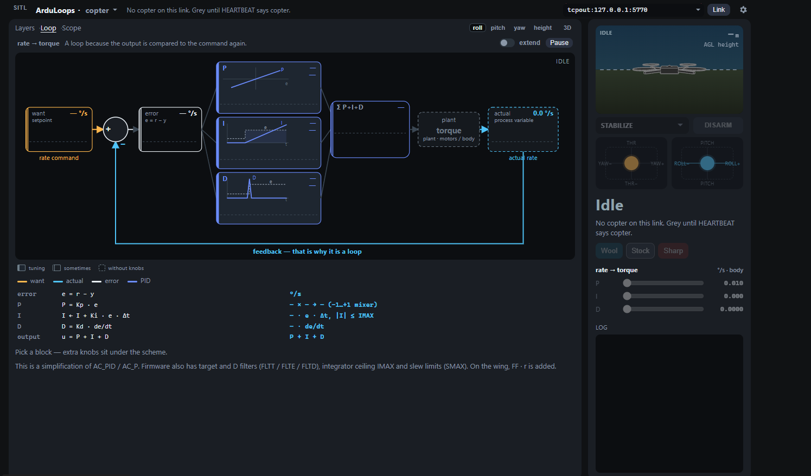

# ArduLoops

A live stand for **seeing ArduPilot loops** — copter and plane. Until a vehicle is linked, the app shows a **disconnected landing** (not a fake copter). HEARTBEAT then mounts the matching shell. **SITL** in the header starts an official sitl-exe from the left rail.

The wiki is the protocol. This stand shows which loops the current mode actually closes.

Disconnected copy is [`docs/start.md`](docs/start.md) (English) and [`docs/start.uk.md`](docs/start.uk.md). Home renders that markdown, including the screenshots.

## Views

### Disconnected

How to Link, how to start SITL on this OS, official First Time Setup / Tuning, what is in or out of scope.

### Copter (after HEARTBEAT)

**Layers** — PosControl (outer) vs Attitude (inner). Dimmed blocks are not closed in this mode.


**Loop** — the selected card as a scheme (rate / angle AC_PID, PosControl P or PID). Axis buttons exist because **one** rate block serves roll, pitch, yaw and height.



**Scope** — traces for any Watch set.


### Plane (after HEARTBEAT)

**Map** — L1 + TECS outside, roll and pitch as **two cards**, yaw damper from AHRS roll, ground steer, then throttle / nose and aileron / elevator / rudder. Empty map shows the live path.


**Loop** — the selected card as a scheme (rate PID + FF, L1 track → bank, TECS energy → pitch + throttle).


**Scope** — traces for any Watch set.

### SITL rail

**SITL** before the title opens a left rail. Pick copter or plane, **Start** — the app downloads sitl-exe if needed and links `tcpout:127.0.0.1:5770`. Wind, GPS, RC fail, motors, IMU are `SIM_*` while the sim is live. **Reset** restores values from the start of the link.


## Requirements

- [Node.js](https://nodejs.org/) (for the UI)
- [Rust](https://rustup.rs/) (MAVLink; browser and desktop)
- An ArduPilot vehicle on MAVLink — in-app **SITL**, or [SITL](https://ardupilot.org/dev/docs/sitl-simulator-software-in-the-loop.html) you start yourself. With `--no-mavproxy`, Link `tcpout:127.0.0.1:5760`. With MAVProxy, often `tcpout:127.0.0.1:5763`.

## Run in the browser

```bash
npm install
npm run dev
```

Open [http://127.0.0.1:5173](http://127.0.0.1:5173). `dev` starts Vite and the headless MAVLink process (`127.0.0.1:8767`).

`?frame=plane` or `?frame=copter` still previews that shell without a link.

Paste a connection string and click **Link**:

| URL | Typical use |
| --- | --- |
| `tcpout:127.0.0.1:5770` | In-app SITL |
| `tcpout:127.0.0.1:5760` | SITL with `--no-mavproxy` (SERIAL0) |
| `tcpout:127.0.0.1:5763` | Extra SITL GCS / MAVProxy first extra |
| `tcpout:127.0.0.1:5762` | If 5763 is already taken |
| `udpin:0.0.0.0:14550` | UDP listen (GCS-style). Vehicle must send here; close other GCS first. |
| `udpout:127.0.0.1:14550` | UDP client, when the vehicle listens |

Each SITL TCP port accepts **one** GCS. Do not run `npm run dev` and the desktop app against the same port at once.

## Desktop

```bash
npm run build      # Windows installers (same UI as `dev`)
```

`npm run build` writes:

- `src-tauri/target/release/bundle/nsis/ArduLoops_1.0.0_x64-setup.exe`
- `src-tauri/target/release/bundle/msi/ArduLoops_1.0.0_x64_en-US.msi`

## Options

Gear in the header.

- **Language** — English (default) or Ukrainian. The choice is kept in the browser.
- **Init** (when linked, disarmed) — write the lab stand dump. Frame class applies while disarmed (1 Hz).
- **Export** — write live parameters to a `.parm` file.
- **MCP** — copy a Cursor config. The running app already serves HTTP `127.0.0.1:8767`.

## MCP

Start ArduLoops first (`npm run dev` or the desktop exe), then add this to Cursor `mcp.json` (Options → MCP → Copy fills in the real path):

```json
{
  "mcpServers": {
    "arduloops": {
      "command": "C:\\Program Files\\ArduLoops\\arduloops.exe",
      "args": ["--mcp"]
    }
  }
}
```

## CLI

Same MAVLink as the UI, via HTTP `127.0.0.1:8767` of the running app.

```bash
npm run cli -- state
npm run cli -- param get ATC_RAT_RLL_P
npm run cli -- mode STABILIZE
```

## Notes

- Copter: `ATC_*` / `PSC_*`. Plane: `RLL_*` / `PTCH_*` / `YAW2SRV_*` / `NAVL1_*` / `TECS_*` / `STEER2SRV_*`.
- Out of scope: QuadPlane, autoland flare, full harmonic-notch wizard, Mission Planner’s full tree, log FFT.
- Copter presets **Wool / Stock / Sharp** are feel on the stand, not a tuning protocol.
- Do not bump `mavlink` in `src-tauri/Cargo.toml` (stay on **0.13.1**).
