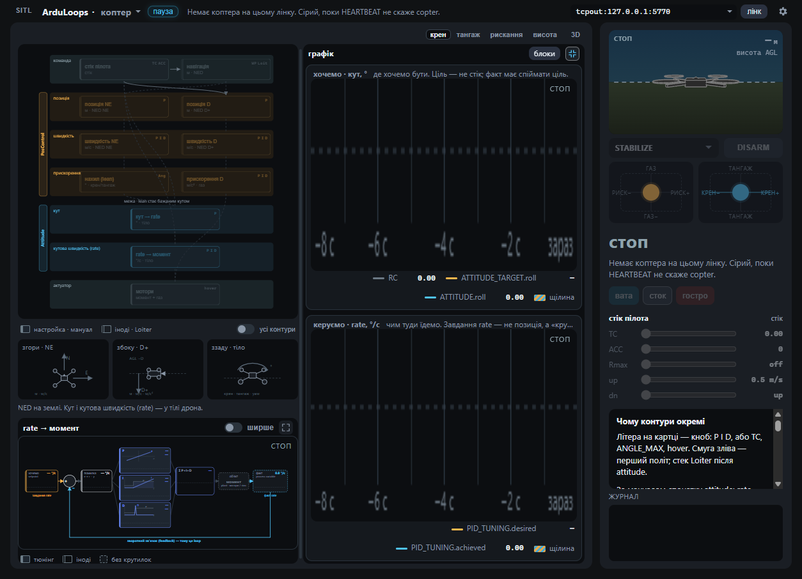
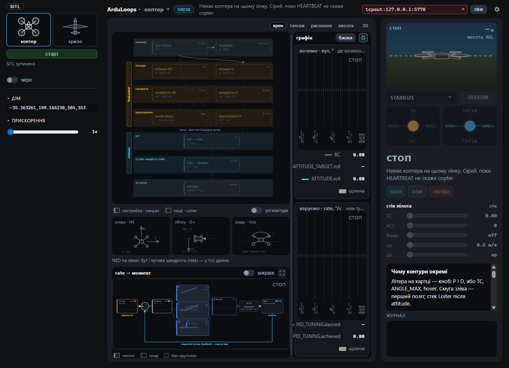
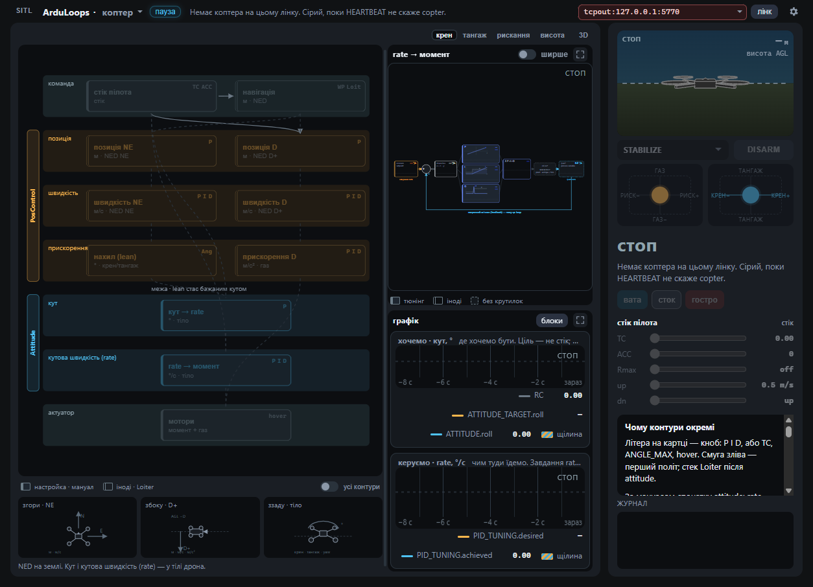
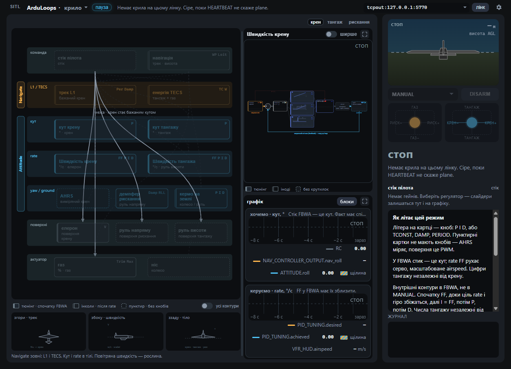
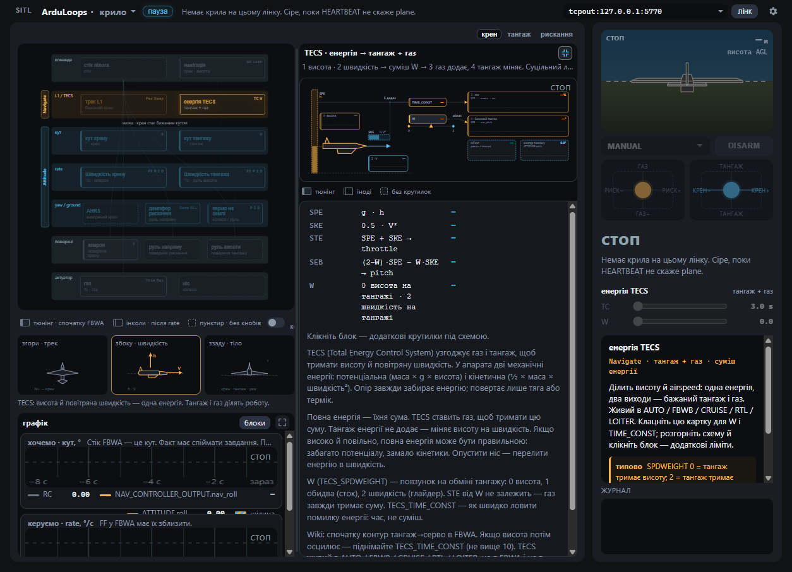

# ArduLoops

A live stand for **seeing** ArduPilot loops. It is not Mission Planner, not Autotune, and not a substitute for the wiki. Link a vehicle; HEARTBEAT picks **copter** or **plane**; then watch which loops the current mode actually closes.

We want an angle. On a copter we command the rate that takes us there. On a wing the stick in FBWA is an angle — **FF**, scaled by airspeed, moves the servo.

Paste a MAVLink URL in the header and click **Link**. Or open **SITL** and **Start**.



## Link

| URL | Typical use |
| --- | --- |
| `tcpout:127.0.0.1:5770` | In-app SITL |
| `tcpout:127.0.0.1:5760` | SITL with `--no-mavproxy` (SERIAL0) |
| `tcpout:127.0.0.1:5763` | Extra SITL GCS / MAVProxy’s first extra |
| `tcpout:127.0.0.1:5762` | If 5763 is already taken |
| `udpin:0.0.0.0:14550` | UDP listen (GCS-style). Vehicle must **send** to this port. Close other GCS first. |
| `udpout:127.0.0.1:14550` | UDP client, when the vehicle is the one listening |

Each SITL TCP port accepts **one** client. Do not point two ArduLoops instances at the same port. WSL SITL `--out 127.0.0.1:14550` stays inside WSL — use the Windows host IP, or `--out udpbcast:0.0.0.0:14550`.

## Start SITL

**SITL** before the title opens a left rail. Pick copter or plane, **Start**. The app downloads official SITL if needed (Windows: Mission Planner sitl-exe; Linux x86_64: firmware `arducopter` / `arduplane`) and Links `tcpout:127.0.0.1:5770`.



To start SITL yourself, build the tree first: [Setting up the Build Environment](https://ardupilot.org/dev/docs/building-the-code.html). Then start a vehicle **without** MAVProxy if ArduLoops is the only GCS:

### Windows (WSL)

Follow [SITL on Windows using WSL](https://ardupilot.org/dev/docs/sitl-on-windows-wsl.html) after [WSL build setup](https://ardupilot.org/dev/docs/building-setup-windows10.html).

```bash
wsl
cd ~/ardupilot
python3 Tools/autotest/sim_vehicle.py -v ArduCopter --no-mavproxy
# or:  -v ArduPlane --no-mavproxy
```

In ArduLoops, **Link** `tcpout:127.0.0.1:5760`. WSL2 localhost forwarding usually publishes that port to Windows. If Link fails, use the WSL IP from `hostname -I`.

Wiki default (`--map --console`) starts MAVProxy; then ArduLoops often uses `tcpout:127.0.0.1:5763`.

### macOS / Linux

On **Linux x86_64**, **Start** in the SITL rail downloads the firmware ELF (`SITL_x86_64_linux_gnu`) and Links `tcpout:127.0.0.1:5770`. There is no aarch64 firmware folder — on ARM or macOS, start SITL yourself.

Same [SITL](https://ardupilot.org/dev/docs/sitl-simulator-software-in-the-loop.html) script after [macOS](https://ardupilot.org/dev/docs/building-setup-mac.html) or [Linux](https://ardupilot.org/dev/docs/building-setup-linux.html) build setup:

```bash
cd ~/ardupilot
python3 Tools/autotest/sim_vehicle.py -v ArduCopter --no-mavproxy
# or:  -v ArduPlane --no-mavproxy
```

**Link** `tcpout:127.0.0.1:5760`.

## After Link

HEARTBEAT.type mounts the shell. Empty frame until the vehicle speaks.

### Copter



One page: **map** on the left, **loop** (the selected card as a scheme) top-right, **traces** bottom-right. Expand a pane for more room. **Pause** in the header freezes the picture; MAVLink still runs. Plot window (8–60 s) is in **Options**.

- **Map** — PosControl (outer) vs Attitude (inner). Dimmed blocks are not closed in this mode
- **Loop** — rate / angle = AC_PID, height and NE = PosControl P or PID. Axis buttons exist because **one** rate block serves roll, pitch, yaw and height
- **Traces** — Watch any block this mode closes (rate: `PID_TUNING` desired vs achieved; angle: demand vs `ATTITUDE`)

Tune rate in **Stabilize**. Wool / Stock / Sharp are feel presets on the stand, not a tuning protocol.

Wiki: [First Time Setup](https://ardupilot.org/copter/docs/initial-setup.html) · [Tuning Process](https://ardupilot.org/copter/docs/tuning-process-instructions.html)

### Plane



Same layout as copter. Click a card — the scheme and traces follow it. Pause is in the header; plot window is in **Options**.

- **Map** — command (stick + mission targets), L1 + TECS outside (not PosControl), roll/pitch angle and rate, yaw damper (AHRS roll, not RLL_RATE), ground steer, then throttle / nose and aileron / elevator / rudder. Empty map shows the mode’s live path; a card shows only its in and out. Roll and pitch are **separate cards**
- **Loop** — rate = AC_PID + FF, L1 = track → bank, TECS = energy → pitch + throttle, yaw = damper, steer = runway. Click a TECS block on the expanded scheme for extra limits



- **Traces** — Watch any block this mode closes (rate: `PID_TUNING`; angle: `nav_roll` / `nav_pitch` vs `ATTITUDE`)

Tune inner loops in **FBWA**, not MANUAL. Pitch numbers are independent of roll.

Wiki: [First Time Setup](https://ardupilot.org/plane/docs/first-time-setup.html) · [Tuning Quickstart](https://ardupilot.org/plane/docs/tuning-quickstart.html) · [Roll/Pitch/Yaw](https://ardupilot.org/plane/docs/new-roll-and-pitch-tuning.html) · [TECS](https://ardupilot.org/plane/docs/tecs-total-energy-control-system-for-speed-height-tuning-guide.html) · [L1 navigation](https://ardupilot.org/plane/docs/navigation-tuning.html) · [Ground steering](https://ardupilot.org/plane/docs/tuning-ground-steering-for-a-plane.html)

## Limits

This stand shows the loops you fly on first setup / first flights, live over MAVLink (`ATTITUDE`, `PID_TUNING`, `VFR_HUD`, watched parameters).

**In scope.** Copter `ATC_*` / `PSC_*`. Plane `RLL_*` / `PTCH_*` / `YAW2SRV_*` / `NAVL1_*` / `TECS_*` / `STEER2SRV_*`.

**Out of scope.** QuadPlane, autoland flare, full harmonic-notch wizard, Mission Planner’s parameter tree, log-based FFT / Autotune as a protocol. If the wiki and this stand disagree, the wiki wins.
